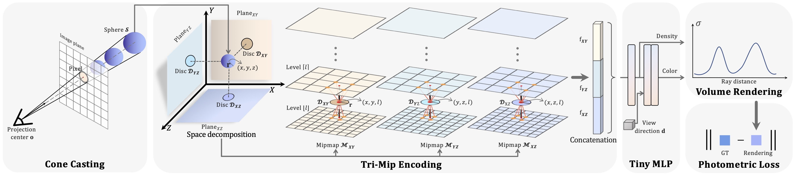
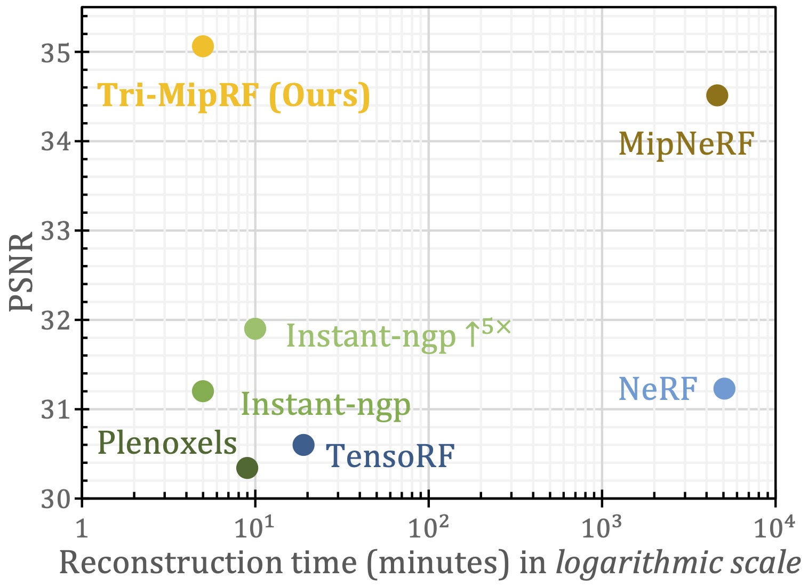

# Tri-MipRF

Official PyTorch implementation of the paper:

> **Tri-MipRF: Tri-Mip Representation for Efficient Anti-Aliasing Neural Radiance Fields**
>
> ***ICCV 2023***
>
> Wenbo Hu, Yuling Wang, Lin Ma, Bangbang Yang, Lin Gao, Xiao Liu, Yuewen Ma
>
> <a href='https://arxiv.org/abs/2307.11335'></a> <a href='https://wbhu.github.io/projects/Tri-MipRF'></a>

https://github.com/wbhu/Tri-MipRF/assets/11834645/6c50baf7-ac46-46fd-a36f-172f99ea9054


> <b>Instant-ngp (left)</b> suffers from aliasing in distant or low-resolution views and blurriness in
> close-up shots, while <b>Tri-MipRF (right)</b> renders both fine-grained details in close-ups
> and high-fidelity zoomed-out images.

<p align="center">

</p>

> To render a pixel, we emit a <b>cone</b> from the camera’s projection center to the pixel on the
> image plane, and then we cast a set of spheres inside the cone. Next, the spheres are
> orthogonally projected
> on the three planes and featurized by our <b>Tri-Mip encoding</b>. After that the feature
> vector is fed into the tiny MLP to non-linearly map to
> density and color. Finally, the density and
> color of the spheres are integrated using volume rendering to produce final color for the pixel.


<p align="center">

</p>

> Our Tri-MipRF achieves state-of-the-art rendering quality while can be reconstructed efficiently,
> compared with cutting-edge radiance fields methods, <i>e.g.,</i> NeRF, MipNeRF, Plenoxels,
> TensoRF, and Instant-ngp. Equipping Instant-ngp with super-sampling (named Instant-ngp<sup>↑5×</sup>)
> improves the rendering quality to a certain extent but significantly slows down the reconstruction.

## **Installation**
Please install the following dependencies first
- [PyTorch (1.13.1 + cu11.6)](https://pytorch.org/get-started/locally/) 
- [tiny-cuda-nn](https://github.com/NVlabs/tiny-cuda-nn)
- [nvdiffrast](https://nvlabs.github.io/nvdiffrast/)

And then install the following dependencies using *pip*
```shell
pip3 install av==9.2.0 \
    beautifulsoup4==4.11.1 \
    entrypoints==0.4 \
    gdown==4.5.1  \
    gin-config==0.5.0 \
    h5py==3.7.0 \
    imageio==2.21.1 \
    imageio-ffmpeg \
    ipython==7.19.0 \
    kornia==0.6.8 \
    loguru==0.6.0 \
    lpips==0.1.4 \
    mediapy==1.1.0 \
    mmcv==1.6.2 \
    ninja==1.10.2.3 \
    numpy==1.23.3 \
    open3d==0.16.0 \
    opencv-python==4.6.0.66 \
    pandas==1.5.0 \
    Pillow==9.2.0 \
    plotly==5.7.0 \
    pycurl==7.43.0.6 \
    PyMCubes==0.1.2 \
    pyransac3d==0.6.0 \
    PyYAML==6.0 \
    rich==12.6.0 \
    scipy==1.9.2 \
    tensorboard==2.9.0 \
    torch-fidelity==0.3.0 \
    torchmetrics==0.10.0 \
    torchtyping==0.1.4 \
    tqdm==4.64.1 \
    tyro==0.3.25 \
    appdirs \
    nerfacc==0.3.5 \
    plyfile \
    scikit-image \
    trimesh \
    torch_efficient_distloss \
    umsgpack \
    pyngrok \
    cryptography==39.0.2 \
    omegaconf==2.2.3 \
    segmentation-refinement \
    xatlas \
    protobuf==3.20.0 \
	jinja2 \
    click==8.1.7 \
    tensorboardx \
    termcolor
```

## **Data**

### nerf_synthetic dataset
Please download and unzip `nerf_synthetic.zip` from the [NeRF official Google Drive](https://drive.google.com/drive/folders/128yBriW1IG_3NJ5Rp7APSTZsJqdJdfc1).

### Generate multiscale dataset
Please generate it by
```shell
python scripts/convert_blender_data.py --blenderdir /path/to/nerf_synthetic --outdir /path/to/nerf_synthetic_multiscale
```

## **Training and evaluation**
```shell
python main.py --ginc config_files/ms_blender/TriMipRF.gin 
```


## **TODO**

- [x] ~~Release source code~~.

## **Citation**

If you find the code useful for your work, please star this repo and consider citing:

```
@inproceedings{hu2023Tri-MipRF,
        author      = {Hu, Wenbo and Wang, Yuling and Ma, Lin and Yang, Bangbang and Gao, Lin and Liu, Xiao and Ma, Yuewen},
        title       = {Tri-MipRF: Tri-Mip Representation for Efficient Anti-Aliasing Neural Radiance Fields},
        booktitle   = {ICCV},
        year        = {2023}
}
```


## **Related Work**

- [Mip-NeRF (ICCV 2021)](https://jonbarron.info/mipnerf/)
- [Instant-ngp (SIGGRAPH 2022)](https://nvlabs.github.io/instant-ngp/)
- [Zip-NeRF (ICCV 2023)](https://jonbarron.info/zipnerf/)
